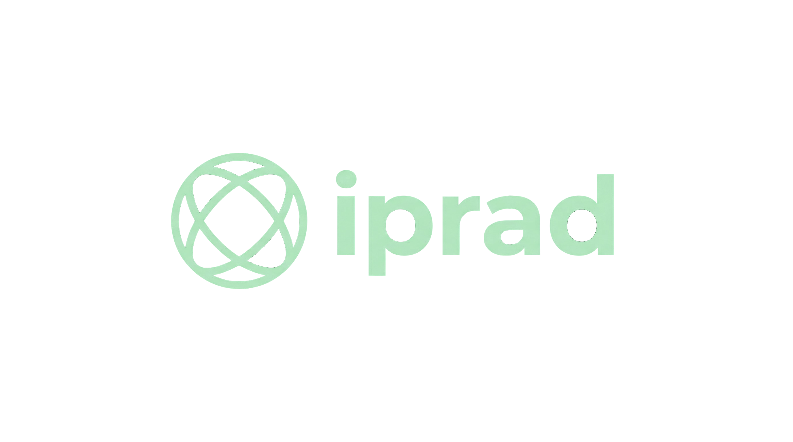
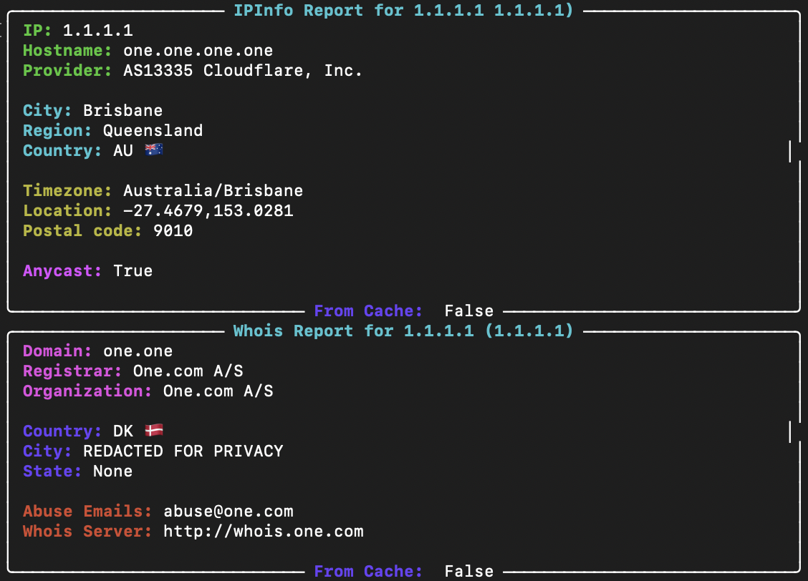

<p align="center">
  
  
  
  
</p>

**iprad** - modular Python-based CLI utility designed for IP Lookup. Built with scalability in mind, it separates core logic into distinct modules for easier maintenance and expansion.

# Architecture 💻
* **Modular Design**: Core functionality is encapsulated within the `src/iprad/core` package.
* **Package Management**: Uses `pyproject.toml` for modern dependency management and entry point configuration.
* **Data Persistence**: Includes a local `.cache` directory for caching results.
# 🚀 Installation

Project uses `pyproject.toml`, you can install it as a package directly from the source.

### Standard installation
```bash
git clone
cd iprad
pip install .
```
Now it is installed in your system

### Alternative method
You can run this comands for installing
```bash
#macOS or Linux
curl -L https://raw.githubusercontent.com/avsbestua/iprad/refs/heads/main/scripts/install.sh | bash
```

```bash
curl -L https://raw.githubusercontent.com/avsbestua/iprad/refs/heads/main/scripts/install.bat -o install.bat && install.bat
```

### For Developers (Editable Mode)
If you plan to modify the code and want changes to take effect immediately:
```bash
git clone https://github.com/avsbestua/iprad.git
cd iprad
pip install -e .
```
# Examples 💾

Let`s try
```bash
iprad check 1.1.1.1
```
And you`ll get this


### Cache cleaning 🧹
**iprad** has cache function. If you want to clean cache run this:
```bash
iprad rmcache
```

You will get this message
```markdown
> Cache removed successfully
```